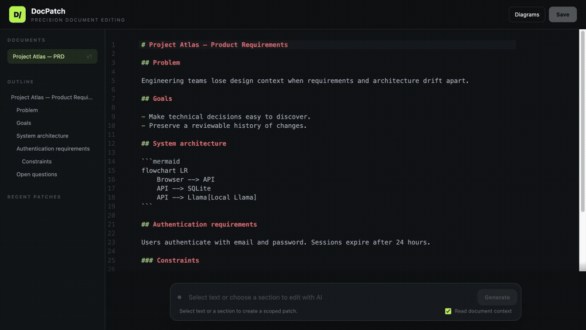

# DocPatch

Code-editor-style AI patches for technical Markdown documents, with Mermaid diagrams and durable SQLite history. The model may read document context, but the Go backend only permits it to replace the explicitly selected range.



## Run

Requirements: Go 1.26+, Node.js 22.22.2+, and pnpm. The default model provider is an OpenAI-compatible local `llama-server`.

```bash
pnpm install
pnpm build
go run .
```

Open <http://127.0.0.1:4173>. By default the app connects to `http://127.0.0.1:8080`.

```bash
LLM_BASE_URL=http://127.0.0.1:8080 LLM_MODEL=local-model PORT=4173 go run .
```

Click a heading in the outline or highlight Markdown, write an instruction, and review the proposed diff before applying it.

For frontend development, run the Go API and `pnpm dev` in separate terminals. Vite runs on port 5173 and proxies `/api` to Go on port 4173.

## Model configuration

DocPatch supports OpenAI-compatible APIs—including local `llama-server`—and Anthropic. Configuration is environment-based:

| Variable | Description |
| --- | --- |
| `LLM_PROVIDER` | `openai` (default) or `anthropic` |
| `LLM_MODEL` | Provider model identifier; defaults to `local-model` for OpenAI-compatible APIs |
| `LLM_BASE_URL` | API base URL; defaults to local Llama for `openai` and Anthropic's API for `anthropic` |
| `LLM_API_KEY` | Provider API key, when required |

`OPENAI_API_KEY` and `ANTHROPIC_API_KEY` are supported as provider-specific alternatives to `LLM_API_KEY`. The legacy `LLAMA_BASE_URL` variable remains supported.

```bash
# OpenAI
LLM_PROVIDER=openai LLM_MODEL=your-openai-model OPENAI_API_KEY=... go run .

# Anthropic
LLM_PROVIDER=anthropic LLM_MODEL=your-anthropic-model ANTHROPIC_API_KEY=... go run .
```

## Verify

```bash
go test ./...
pnpm build
```

Documents, immutable revisions, and patch proposals are stored in `data/docpatch.db`. DocPatch sends the selected text and, when enabled, the rest of the document as read-only context to the configured model provider. With the default local configuration, no document data is sent to a hosted service.

See [docs/architecture.md](docs/architecture.md) for package boundaries, dependency direction, and extension points.
